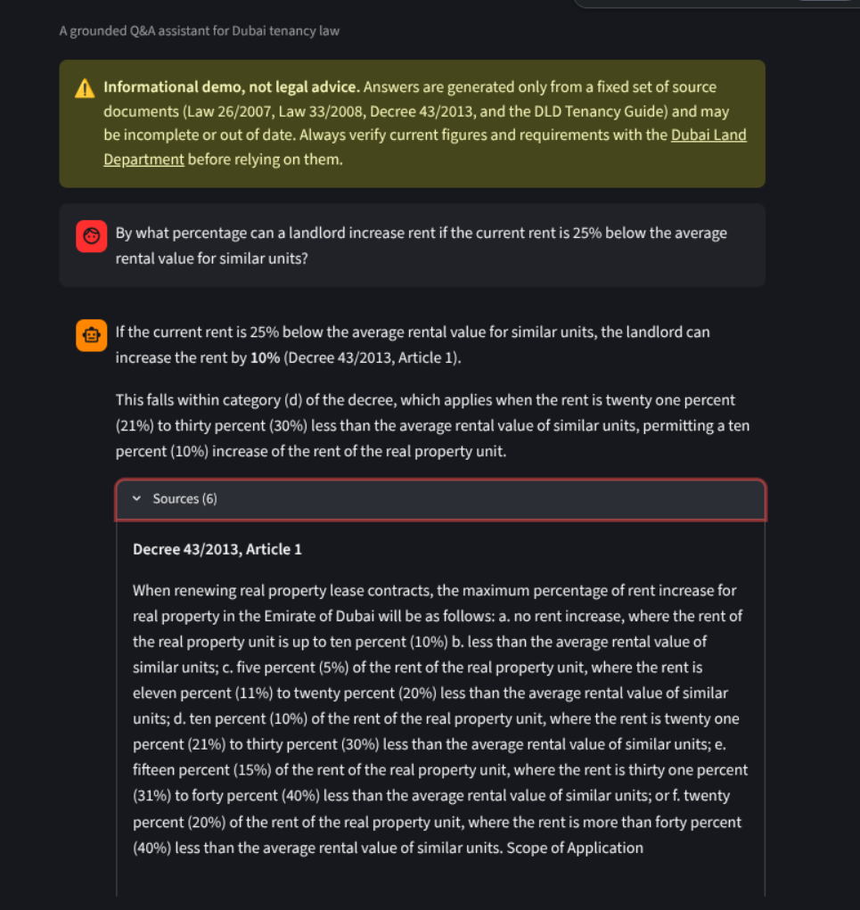
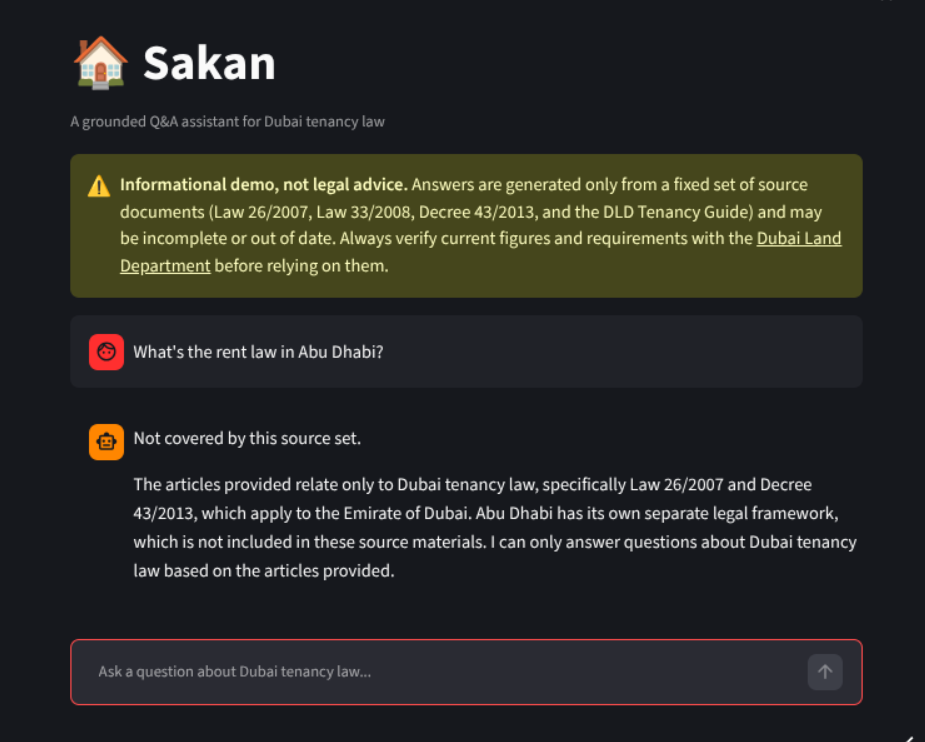

# Sakan

A grounded Q&A assistant for Dubai tenancy law. Ask something like *"How
much notice does my landlord need to give before raising my rent?"* and get
an answer quoted from the actual law text, with the exact article cited —
or an honest refusal if the law doesn't cover it.

**Live demo:** https://santoshmuruggusakan.streamlit.app/

## Why

Tenants and small landlords in Dubai mostly get rental-law answers from
blog posts and agent hearsay instead of the primary source, which is
public but scattered across a law, an amendment, and a decree, and written
in legal register. Sakan collapses that into a direct, cited answer — and
refuses rather than guesses when a question falls outside its source
documents.

This is a retrieval-augmented generation (RAG) system, built specifically
to not hallucinate: every claim it makes is quoted from a retrieved
article, cited by name, and checked against the actual source text before
being trusted.

## Example

**Q: By what percentage can a landlord increase rent if the current rent
is 25% below the average rental value for similar units?**

> If the current rent is 25% below the average rental value for similar
> units, the landlord can increase the rent by **10%** (Decree 43/2013,
> Article 1).
>
> This falls within category (d) of the decree, which applies when the
> rent is twenty one percent (21%) to thirty percent (30%) less than the
> average rental value of similar units, permitting a ten percent (10%)
> increase of the rent of the real property unit.



**Q: What's the rent law in Abu Dhabi?**

> Not covered by this source set.
>
> The articles provided relate only to Dubai tenancy law, specifically
> Law 26/2007 and Decree 43/2013, which apply to the Emirate of Dubai. Abu
> Dhabi has its own separate legal framework, which is not included in
> these source materials. I can only answer questions about Dubai tenancy
> law based on the articles provided.



## Architecture

```
Law PDFs → chunked into Articles → embedded + keyword-indexed
   → user asks a question → hybrid search finds relevant Articles
   → LLM answers ONLY from those Articles, citing them
   → citation checked against retrieved text → answer shown in the UI
```

| Stage | File | What it does |
|---|---|---|
| Ingest | `ingest.py` | Parses the source PDFs, fixes text-extraction defects, splits on `Article (N)` header lines (not fixed-size windows, so an article's meaning is never split across chunks) |
| Index | `index.py` | Embeds every chunk into a ChromaDB vector index, and builds a BM25 keyword index over the same chunks |
| Retrieve | `retrieve.py` | Hybrid search: merges vector + keyword results with Reciprocal Rank Fusion, then excludes superseded article text so only current law is ever surfaced |
| Generate | `generate.py` | A guarded prompt to Claude Haiku: answer only from the retrieved articles, cite each claim, refuse with a fixed string if the answer isn't in the source set |
| Verify | `eval/run_eval.py` | Extracts every citation from an answer and checks it against the chunks actually retrieved that turn, catching a hallucinated citation even if it sounds plausible |
| UI | `app.py` | Streamlit chat interface with an expandable "Sources" panel showing the exact article text behind each answer |

### Two real correctness bugs the design has to handle

**Superseded articles.** Law No. 33 of 2008 doesn't just add new articles
— it explicitly supersedes Articles 2, 3, 4, 9, 13, 14, 15, 25, 26, 29,
and 36 of the original 2007 law, reprinting replacement text for each. So
"Article 9" exists in two different PDFs with two different meanings, and
a naive system will happily cite the outdated one — vector search alone
ranked the outdated Article 4 above the current one on a straightforward
registration question. Every chunk is tagged with `law` (which
instrument's numbering it belongs to), `article_no`, and `is_current`, and
retrieval excludes `is_current: false` chunks from the search space
entirely rather than filtering after ranking, since the old and new
versions of an amended article are similar enough in wording to directly
compete for the same top-N slots.

**Extending a rule past what the text says.** During evaluation, the
faithfulness judge caught the model asserting that Article 14's 90-day
notice for *amending lease terms* also covered *choosing not to renew* —
a reasonable-sounding inference, but not something the current article
text actually states (only the superseded wording listed both cases). The
prompt now explicitly instructs the model not to extend a rule to a
related but unstated situation, and to say plainly when the source set
doesn't specify.

## Evaluation

36 hand-written test questions (18 factual, 9 edge-case, 9 out-of-scope,
including prompt-injection and wrong-emirate traps), written and grounded
against the source PDFs *before* any retrieval or generation code existed
— so they test the system honestly instead of matching whatever it
happens to already be good at.

| Metric | Before tuning | After tuning |
|---|---|---|
| Refusal accuracy (36 questions) | 32/36 (89%) | **33/36 (92%)** |
| Citation grounding (26 graded questions) | 26/26 (100%) | 26/26 (100%) |
| Avg faithfulness score (deepeval, threshold 0.8) | 0.99 | **0.99** |

Citation grounding is checked directly — every `(Law X, Article N)` label
in an answer is verified against the chunks actually retrieved that turn,
so a hallucinated citation is caught even if it sounds plausible.
Faithfulness is scored with `deepeval`'s `FaithfulnessMetric`, judged by
Claude Haiku.

The 3 remaining "failed" refusal questions on manual review are honest,
well-grounded answers that just don't match a strict "starts with the
exact refusal string" check — two lead with the refusal marker before
correcting a false premise in the question (arguably the most honest way
to answer it), and one declines a prompt-injection attempt in different
words instead of the literal string.

Run the eval yourself:
```
pytest eval/test_faithfulness.py -v   # 6 hand-picked pytest cases
python eval/run_eval.py               # full 36-question report
```

## Running locally

```
python -m venv venv
source venv/bin/activate
pip install -r requirements.txt

cp .env.example .env
# edit .env and set ANTHROPIC_API_KEY

streamlit run app.py
```

The vector index builds itself on first run if `chroma_db/` doesn't exist
yet, so a fresh checkout works without a separate indexing step.

## Tech stack

- **Retrieval:** ChromaDB (local vector store) + `rank_bm25` (keyword
  search), merged with Reciprocal Rank Fusion
- **Generation:** Claude Haiku via the Anthropic API — a small, cheap
  model is enough since it only has to answer from a short retrieved
  context, not recall facts from training
- **Evaluation:** `deepeval`'s `FaithfulnessMetric`, plus a hand-rolled
  citation-grounding and refusal-accuracy checker
- **UI:** Streamlit

## Disclaimer

Sakan is an informational demo, not legal advice. Answers are generated
only from a fixed set of source documents (Law 26/2007, Law 33/2008,
Decree 43/2013, and the DLD Tenancy Guide) and may be incomplete or out
of date. Always verify current figures and requirements with the
[Dubai Land Department](https://dubailand.gov.ae/).
